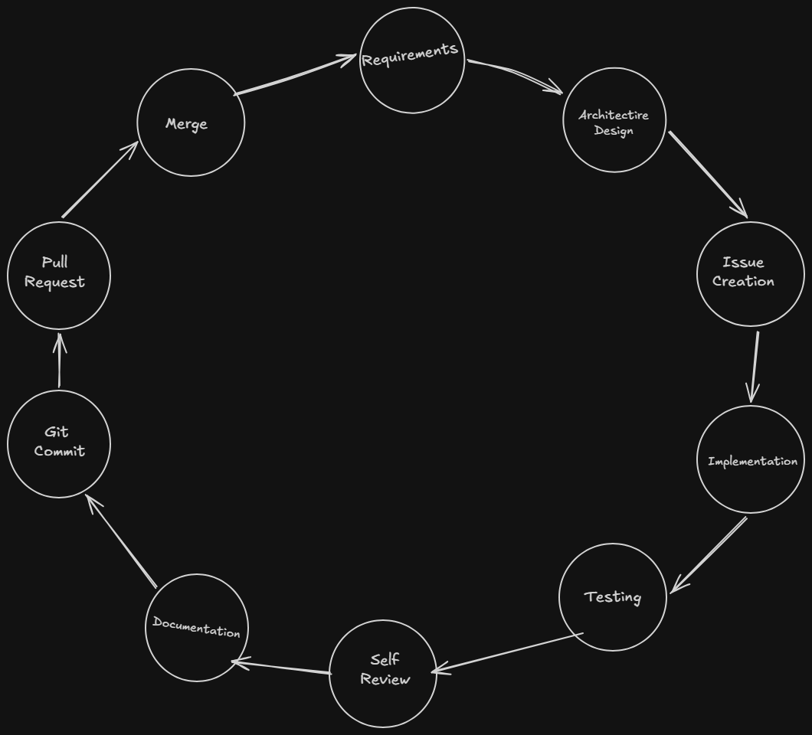

# SentinelSIEM Development Roadmap

> Last Updated: 05-07-2026 or 5th July 2026

---

# Vision

SentinelSIEM is a lightweight, modular, open-source Security Information and Event Management (SIEM) platform built for learning, portfolio development, and understanding how modern SIEM platforms work internally.

The goal is **not** to replace enterprise SIEM solutions, but to implement their core concepts using clean software engineering practices and make it available to normal people as a free open source tool.

---

# Engineering Principles

Every feature should be:

- Modular
- Testable
- Documented
- Extensible
- Secure by default
- Easy to understand

---

# Development Workflow

Every feature follows the same lifecycle.

No feature is considered complete until every step has been completed.

---

# Git Workflow

## Main Branches

main
- Production-ready code

develop
- Integration branch for completed features

---

## Feature Branches

Every feature starts from develop.

Example

feature/log-generator

feature/parser

feature/detection-engine

feature/database

feature/api

feature/dashboard

feature/authentication

feature/docker

---

## Bug Fixes

bugfix/parser-regex

bugfix/api-pagination

---

## Documentation

docs/readme-update

docs/api-documentation

---

## Branch Rules

Never commit directly to main.

Never develop directly on main.

Every feature should be merged into develop first.

Only stable releases are merged into main.

---

# Commit Convention

Use Conventional Commits.

Examples

feat: implement SSH log generator

feat: add parser framework

fix: correct regex parsing bug

docs: update system overview

refactor: simplify detection engine

test: add parser unit tests

chore: initialize project structure

---

# Project Versions

## v0.1

Project Foundation

Status:
Completed

Deliverables

- Repository
- Folder structure
- Documentation
- Git configuration

---

## v0.2

Data Collection

Features

- SSH Log Generator
- Attack Simulation
- Configurable Generator

---

## v0.3

Processing

Features

- SSH Parser
- JSON Normalization
- Validation

---

## v0.4

Detection

Features

- Rule Engine
- Brute Force Detection
- Suspicious Login Detection
- Alert Generation

---

## v0.5

Storage

Features

- MongoDB
- Repository Layer
- Indexes

---

## v0.6

Backend API

Features

- Express API
- REST Endpoints
- Swagger Documentation

---

## v0.7

Dashboard

Features

- React Dashboard
- Alert Viewer
- Log Viewer
- Statistics
- Search

---

## v0.8

Authentication

Features

- JWT
- Role-Based Access Control
- Login
- User Management

---

## v0.9

Deployment

Features

- Docker
- Docker Compose
- Environment Configuration

---

## v1.0

Production Release

Features

- Testing
- CI/CD
- Documentation
- GitHub Release

---

# Definition of Done

A task is complete only if:

- Requirements satisfied
- Code reviewed
- Unit tests written
- Tests passing
- Documentation updated
- Git history clean
- Ready for merge

---

# Coding Standards

Python

- PEP 8
- Type hints
- Docstrings
- Small functions
- Single Responsibility Principle

JavaScript

- ESLint
- async/await
- Feature-based folder structure

React

- Functional components
- Hooks
- Reusable UI components

---

# Documentation Standards

Every feature should update:

- README
- Architecture (if applicable)
- API documentation (if applicable)
- Issue status

---

# Testing Strategy

Python

pytest

Node.js

Jest

Frontend

React Testing Library

---

# Future Enhancements

- Apache Logs
- Windows Event Logs
- Syslog Receiver
- CloudTrail
- Azure Activity Logs
- GCP Audit Logs
- Sigma Rules
- MITRE ATT&CK Mapping
- Threat Intelligence
- GeoIP
- Email Alerts
- Slack Alerts
- AI-based Anomaly Detection

---

# Long-Term Goal

Develop SentinelSIEM as if it were a real open-source security platform.

Every architectural decision should prioritize:

- Maintainability
- Extensibility
- Readability
- Security
- Developer Experience